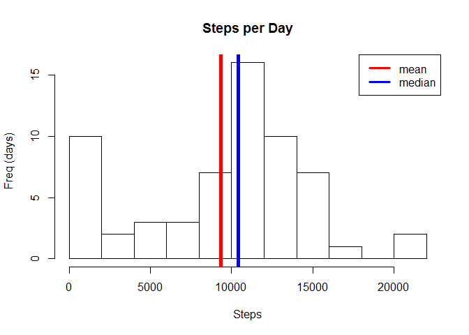
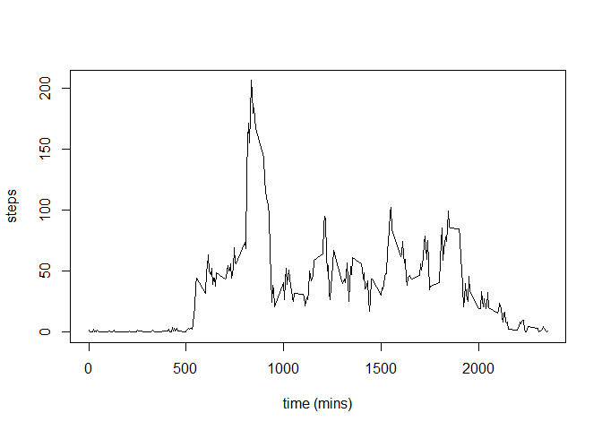
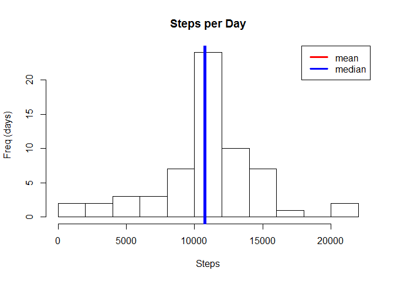
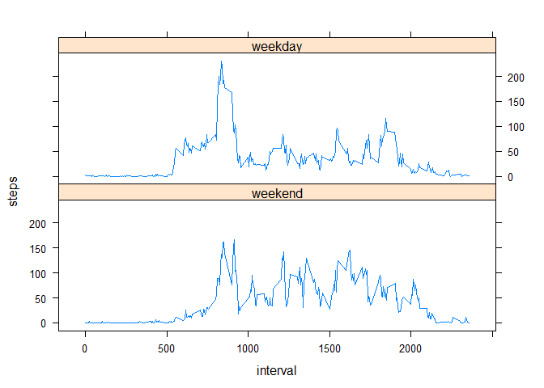

# Reproducible Research: Peer Assessment 1
Yu Lu  
2015-09-20  

## Loading and preprocessing the data

```r
activity_data <- read.csv("activity.csv")
library(dplyr)
```

```
## 
## Attaching package: 'dplyr'
## 
## The following object is masked from 'package:stats':
## 
##     filter
## 
## The following objects are masked from 'package:base':
## 
##     intersect, setdiff, setequal, union
```
## What is mean total number of steps taken per day?


```r
group_by_date <- group_by(activity_data,date)
steps_per_day <- summarize(group_by_date,steps = sum(steps,na.rm = T))
with(steps_per_day,hist(steps,main = "Steps per Day", xlab ="Steps",ylab = "Freq (days)",breaks = 10))
average_steps <- mean(steps_per_day$steps)
median_steps <- median(steps_per_day$steps)
abline(v = average_steps, col = "red", lwd = 5)
abline(v = median_steps, col = "blue", lwd = 5)
legend("topright",legend = c("mean","median"), col = c("red","blue"), lty = 1, lwd = 3)
```

 


The average steps per day is **9354.2295082**. The median steps per day is **10395**.

## What is the average daily activity pattern?

```r
group_by_interval <- group_by(activity_data,interval)
steps_per_interval <- summarize(group_by_interval,steps = mean(steps,na.rm = T))
with(steps_per_interval,plot(interval,steps,type = "l", xlab = "time (mins)"),ylab = "steps")
```

 

```r
index <- match(max(steps_per_interval$steps),steps_per_interval$steps)
max_interval <- steps_per_interval[index,1]
```
Interval **835** contains the maximum number of steps.

## Imputing missing values


```r
num_NA <- table(is.na(activity_data$steps))[2]
```

The total number of missing value in the dataset is **2304**.

The missing value in the database will be filled with mean for that 5-minute interval.


```r
group_by_interval<- mutate(group_by_interval,average = mean(steps,na.rm = T))
na_filling <- activity_data
for(i in 1:nrow(group_by_interval)){
  if(is.na(group_by_interval$steps[i])){
    na_filling$steps[i] <- group_by_interval$average[i]
  }}
na_filling <- group_by(na_filling,date)
total_steps <- summarize(na_filling,steps = sum(steps))
with(total_steps,hist(steps,main = "Steps per Day", xlab ="Steps",ylab = "Freq (days)",breaks = 10))
new_average <- as.integer(mean(total_steps$steps))
new_median <- as.integer(median(total_steps$steps))
abline(v = new_average, col = "red", lwd = 5)
abline(v = new_median, col = "blue", lwd = 5)
legend("topright",legend = c("mean","median"), col = c("red","blue"), lty = 1, lwd = 3)
```

 

The average steps per day is **10766**. The median steps per day is **10766**.

The mean and median after imputing missing value are bigger than those before.

The imputing missing value increased the total number of steps per day.

## Are there differences in activity patterns between weekdays and weekends?

```r
na_filling <- ungroup(na_filling)
na_filling <- transform(na_filling, date = as.Date(date,"%Y-%m-%d"))
na_filling <- mutate(na_filling,weekday = weekdays(date))
weekend <- c("Saturday","Sunday")
na_filling <- mutate(na_filling,wDay = factor(weekday %in% weekend,levels = c("TRUE","FALSE"), label = c("weekend","weekday")))
group_by_interval_wDay <- group_by(na_filling,interval,wDay)
average_step <- summarize(group_by_interval_wDay,steps = mean(steps))
library(lattice)
xyplot(steps~interval | wDay, data =average_step,type = "l", layout= c(1,2))
```

 
